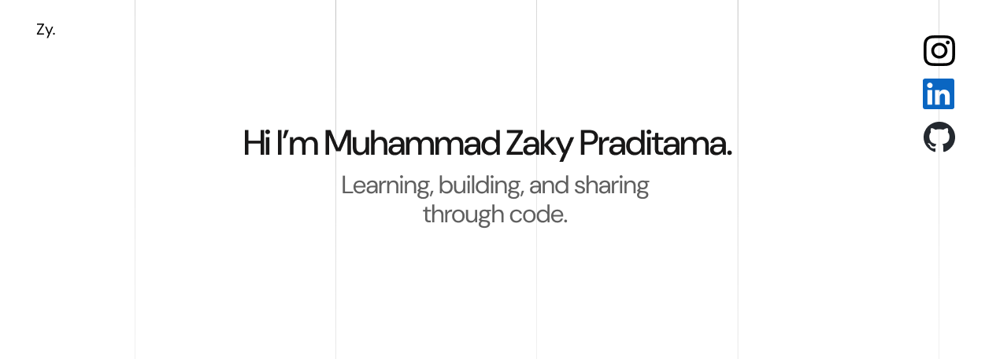

## Hi there 👋, I'm Muhammad Zaky Praditama

   

Hi 👋, I’m Muhammad Zaky Praditama, an Informatics student at Universitas Muhammadiyah Malang 🏫 with a strong interest in web development, UI/UX design, and database management.

<table>
<table>
<tr>
<td width="50%" valign="top">

##### Information about me

- 🧑‍💻 I’m currently working on web development and UI/UX design projects
- 🗄️ I’m currently learning backend fundamentals, database management, and modern web development
- 🤝 I’m looking to collaborate on website development, UI/UX design, and digital product projects
- ⚙️ I’m looking for help with backend development, database optimization, and scalable web applications
- 💡 Ask me about Web Development, UI/UX Design, Figma, Canva, and Database Management
- 📩 How to reach me: **zakypraditama@gmail.com**
</td>
<td width="50%" valign="top">

 

</td>
</tr>
</table>

#### 💻 Languages and Tools I Have Learned

                       

<!--
**Jopjop-416/Jopjop-416** is a ✨ _special_ ✨ repository because its `README.md` (this file) appears on your GitHub profile.

Here are some ideas to get you started:

- 🔭 I’m currently working on ...
- 🌱 I’m currently learning ...
- 👯 I’m looking to collaborate on ...
- 🤔 I’m looking for help with ...
- 💬 Ask me about ...
- 📫 How to reach me: ...
- 😄 Pronouns: ...
- ⚡ Fun fact: ...
-->
